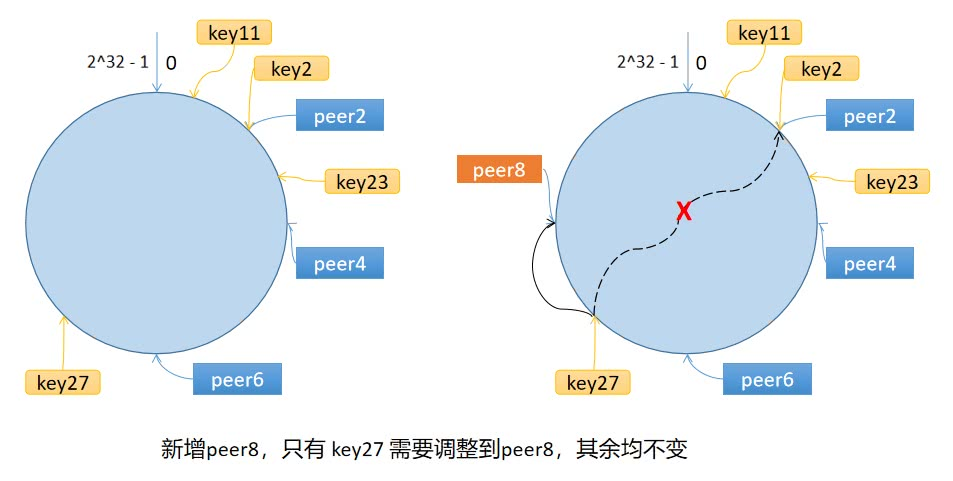

## GeeCache

动手写一个小分布式缓存，基本模仿groupcache的实现

其支持的特性有：

- 单机缓存和基于 HTTP 的分布式缓存
- 最近最少访问(Least Recently Used, LRU) 缓存策略
- 使用 Go 锁机制防止缓存击穿
- 使用一致性哈希选择节点，实现负载均衡
- 使用 protobuf 优化节点间二进制通信

### LRU缓存淘汰策略
最近最少使用，如果数最近被访问过，那么将来被访问的概率也会更高。LRU算法维护一个队列，如果某条记录被访问了，则移动到对尾，那么队首就是最近最少访问记录，淘汰即可。
核心的两个数据就是字典和双向链表。
- 字典存储键和值的映射关系。根据键查找值的复杂度是O(1)，在字典中插入一条记录的复杂度也是O(1)
- 双向链表实现队列。将所有的值放到双向链表中，这样，当访问到某个值时，将其移动到队尾的复杂度是O(1)，在队尾新增一条记录以及删除一条记录的复杂度均为O(1)。

### 单机并发缓存
1、使用sync.Mutex互斥锁来解决多协程并发冲突问题
2、实现Group负责与用户的交互并控制缓存值存储和获取的流程，当缓存不存在时，调用回调函数获取源数据

```
                            是
接收 key --> 检查是否被缓存 -----> 返回缓存值 ⑴
                |  否                         是
                |-----> 是否应当从远程节点获取 -----> 与远程节点交互 --> 返回缓存值 ⑵
                            |  否
                            |-----> 调用`回调函数`，获取值并添加到缓存 --> 返回缓存值 ⑶

```

### 一致性哈希
一致性哈希可以很好的防止缓存雪崩，即缓存在同一时刻全部失效，造成瞬时DB请求量大、压力骤增，该算法将key映射到2^32的空间中，将这个数字首位相连，形成一个环。
- 计算节点/机器(通常使用节点的名称、编号和 IP 地址)的哈希值，放置在环上。
- 计算 key 的哈希值，放置在环上，顺时针寻找到的第一个节点，就是应选取的节点/机器。


#### 数据倾斜
如果服务器的节点过少，容易引起 key 的倾斜。为了解决数据倾斜问题，引入虚拟节点，即一个真实节点对应多个虚拟节点。
假设 1 个真实节点对应 3 个虚拟节点，那么 peer1 对应的虚拟节点是 peer1-1、 peer1-2、 peer1-3（通常以添加编号的方式实现），其余节点也以相同的方式操作。
- 第一步，计算虚拟节点的 Hash 值，放置在环上。
- 第二步，计算 key 的 Hash 值，在环上顺时针寻找到应选取的虚拟节点，例如是 peer2-1，那么就对应真实节点 peer2。
虚拟节点扩充了节点的数量，解决了节点较少的情况下数据容易倾斜的问题。而且代价非常小，只需要增加一个字典(map)维护真实节点与虚拟节点的映射关系即可。

### 分布式节点
当需要从远程获取节点时，采用一致性哈希算法来选择节点，具体流程如下：

```

使用一致性哈希选择节点        是                                    是
    |-----> 是否是远程节点 -----> HTTP 客户端访问远程节点 --> 成功？-----> 服务端返回返回值
                    |  否                                    ↓  否
                    |----------------------------> 回退到本地节点处理。                            

```

### 防止缓存击穿
缓存击穿指的是一个存在的key，在缓存过期的一刻，同时有大量的请求，这些请求都会击穿到 DB ，造成瞬时DB请求量大、压力骤增。为了防止这种情况，我们采取的策略是 针对相同的key,相同的节点向另一远程节点只发起一次请求。定义两种结构 call 和 Group
- call代表正在进行中或已经结束的请求
- Group 用来管理不同的 key 的请求 call
在 Group 中实现 Do 方法，接收 2 个参数，第一个参数是 key，第二个参数是一个函数 fn。Do 的作用就是，针对相同的 key，无论 Do 被调用多少次，函数 fn 都只会被调用一次，等待 fn 调用结束了，返回返回值或错误。